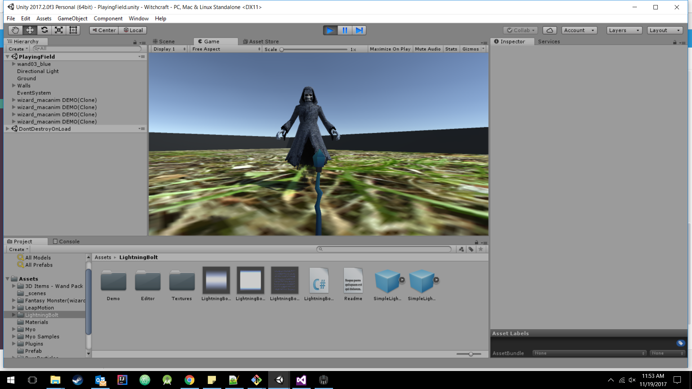
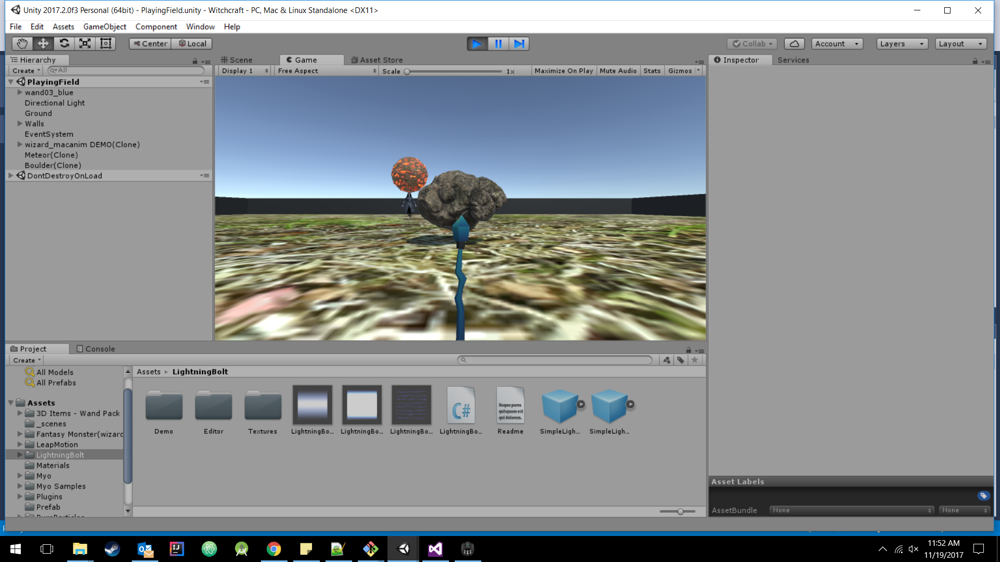
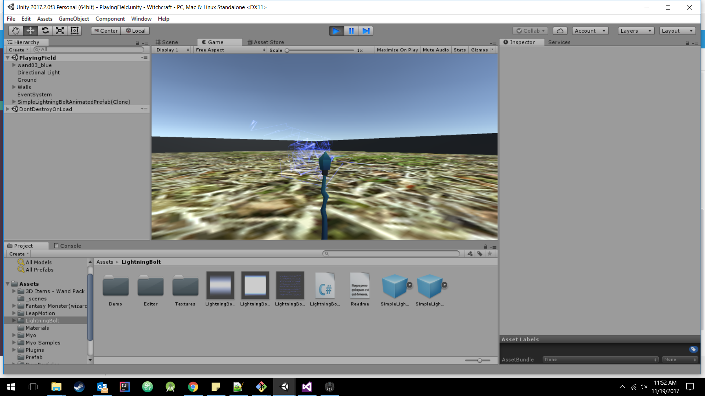

# WizCraft
A 3-D gesture controlled competitive game against AI, made with Unity engine. A Myo armband is used to play the game and cast spells against AI bots!
Project submitted and demoed at [HackWITus2](https://devpost.com/software/wizcraft) 2017.

## Inspiration

Our main inspiration behind this project was to integrate the Myo armband with Unity and learn more about the artificially intelligent bots we could compete with. We successfully made a 3D competitive game using Unity and Myo armband.

## What it does

Compete against the bot using different gestures to cast spells and attack!

## How We built it

This was built using the Unity Game Engine in which the scripts were written in C#. The Myo armband was integrated with the game to give gesture controlled inputs to the game.

## Challenges We ran into

Programming the AI bot was the main challenge we ran into. Also, configuring the different spells to make them work properly was harder than imagined,

## Accomplishments that We're proud of

Making an interesting gesture controlled game from scratch in less than 12 hours. We were completely new to the Unity game engine as well as the Myo armband, but by the end of the Hackathon, we successfully implemented our idea and learned a lot in the process.

## What We learned

Programming the AI to compete against users, successfully integrating the game with Myo armband. Coming up with creative spells and implementing them in our game.

## What's next for WizCraft

In the future we want multiple players to compete against each other through a centralized server. We can also add power-ups, special powers, cool-down time between consecutive attacks, and an attractive UI to make it more appealing. In conclusion, we can add a whole lot of stuff to our game and make it bigger and better.

## Built With

Unity, Myo Armband, C#

## Some Screenshots of our Game in action

- Bot

- Spell 1: Boulders

- Spell 2: Lightning

